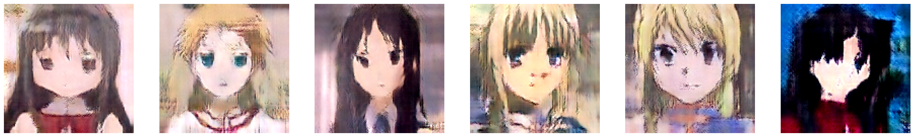

# StyleGAN with anime image

## Define folder
* `trainB1`: .(small dataset) anime image
    I only train with small dataset 
* `model`: save model disciminator and generator with special block layers
* `util` : save needed function (include wasserstein_loss)

## to run and check repository
- Have to create new environment and pip install tensorflow with cuda :
1. conda create -n tensoflow_env python=3.10
2. conda activate tensoflow_env
3. conda install -c conda-forge cudatoolkit=11.2 cudnn=8.1.0
4. python -m pip install "tensorflow==2.10"
5. pip install opencv-python
6. pip install matplotlib
7. pip install pip install tensorflow-addons

## Result:

